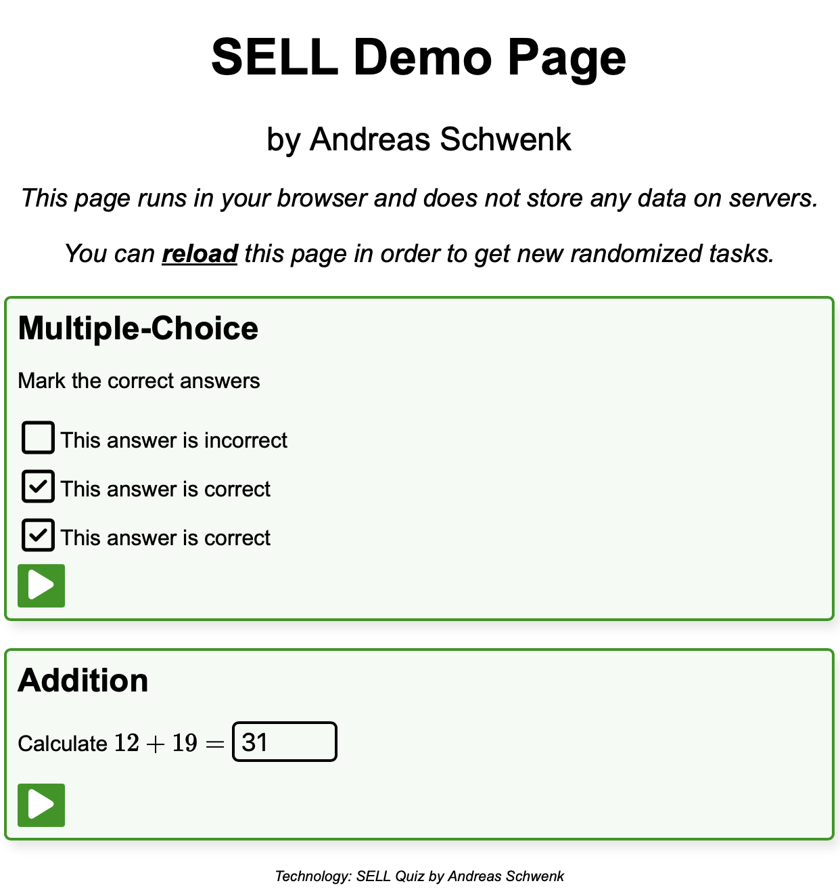

# sell4ever

Re-implementation of the essentials of the Simple E-Learning Language (SELL) for Longevity.

## Dependencies

**Users:** Python 3 and `pip install numpy`.

**Developers:** Node.js + a local web server for debugging the web code (or alternatively install the recommended VS-code extension in this repository).

## User Guide

Download and run `sell.py` from this repository.

Run `python sell.py FILENAME.txt` to generate a self-contained quiz-website `FILENAME.html` from sources in `FILENAME.txt`. You will find an example below, and more examples in directory `examples/`.

## Developer Guide

To debug (or extend) the web code, start a web server and open `index.html`.
File `src/example.js` provides example questions (generated by `sell.py`).

Run `npm run build` or `node build.js` to update variable `html` in file `sell.py`.

## Example

The following example code generates two questions, as seen in the figure.



Command:

```bash
python sell.py ex1.txt
```

File `ex1.html` will be generated.

Contents of `ex1.txt`;

```
LANG    en
TITLE   Demo
AUTHOR  Andreas Schwenk


QUESTION Multiple-Choice
Mark the correct answers
[x] This answer is correct
[x] This answer is correct
[ ] This answer is incorrect


QUESTION Addition
"""
import random
x = random.randint(10, 20)
y = random.randint(10, 20)
z = x + y
"""
Calculate $x + y =$ #z
```

## Syntax

### Global

- `LANG` defines the language (currently, only `en` is supported).
- `TITLE` defines the pages title.
- `AUTHOR` defines the author/institution of the quizzes.
- `QUESTION` marks the beginning of a new question. The title of the question is written into the same line.

### Question

A question consists of a textual part, and optionally of Python code, to generate random variables and to calculate the sample solution.

**Question text**

- Text to be displayed is written in plain text.
- Bold text is embedded into a pair of `*`.
- Itemizations are preceded by `-`.
- TeX-based inline math is embedded into a pair of `$`.
- Multiple-Choice questions are preceded by `[x]` for correct answers, or `[ ]` for incorrect answers, respectively.
- Single-Choice questions are preceded by `(x)` for the correct answer, and `( )` for incorrect answers, respectively.

**Question code**

To generate randomized variables, arbitrary Python-Code can be evaluated (this is secure, since the code is executed only locally on the teachers computer).

For each question, 5 instances are drawn. In case that you won't use random numbers, all instances are equal.

- Python code is embedded into a pair of `"""`. The triple-quotations must written in distinct lines, without any other characters. Python code be provided before its variables are accessed in the textual part.

- Variables denoted in math mode in text are replaced by its actual values (the execution environment randomly chooses one of the 5 instances).

- Input fields a generated by `#` with the following variable name. The structure of the input field depends on the variable type of the variable (`int`, `set`, `numpy.array`, ...).

<!-- TODO: write about types (impl is WIP):
int, float, set, matrix
-->
