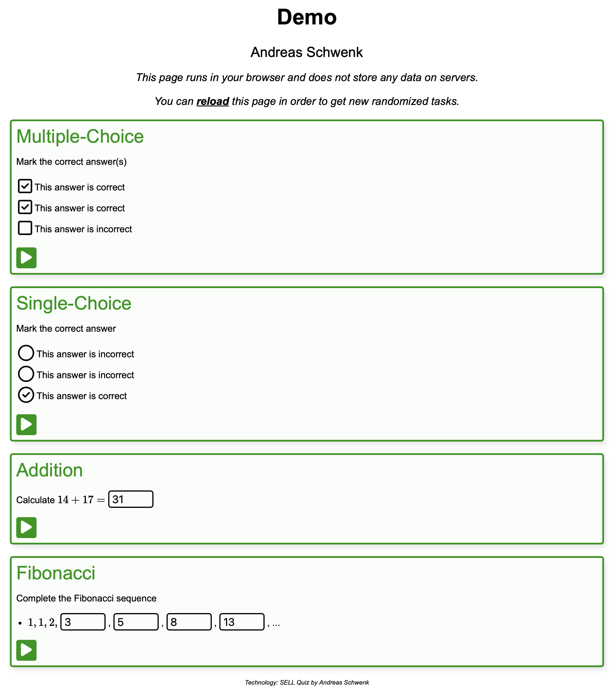

# sell4ever

Re-implementation of the essentials of the Simple E-Learning Language (SELL) for Longevity.

## Usage

Download and run `sell.py` from this repository.

Run `python sell.py FILENAME.txt` to generate a self-contained quiz-website `FILENAME.html` from sources in `FILENAME.txt`.

## Example

The following example code generates two questions, as seen in the figure.



Command:

```bash
python sell.py ex1.txt
```

Contents of `ex1.txt`;

```
LANG    en
TITLE   Demo
AUTHOR  Andreas Schwenk


QUESTION Multiple-Choice
Mark the correct answers
[x] This answer is correct
[x] This answer is correct
[ ] This answer is incorrect


QUESTION Addition
"""
import random
x = random.randint(10, 20)
y = random.randint(10, 20)
z = x + y
"""
Calculate $x + y =$ #z
```
