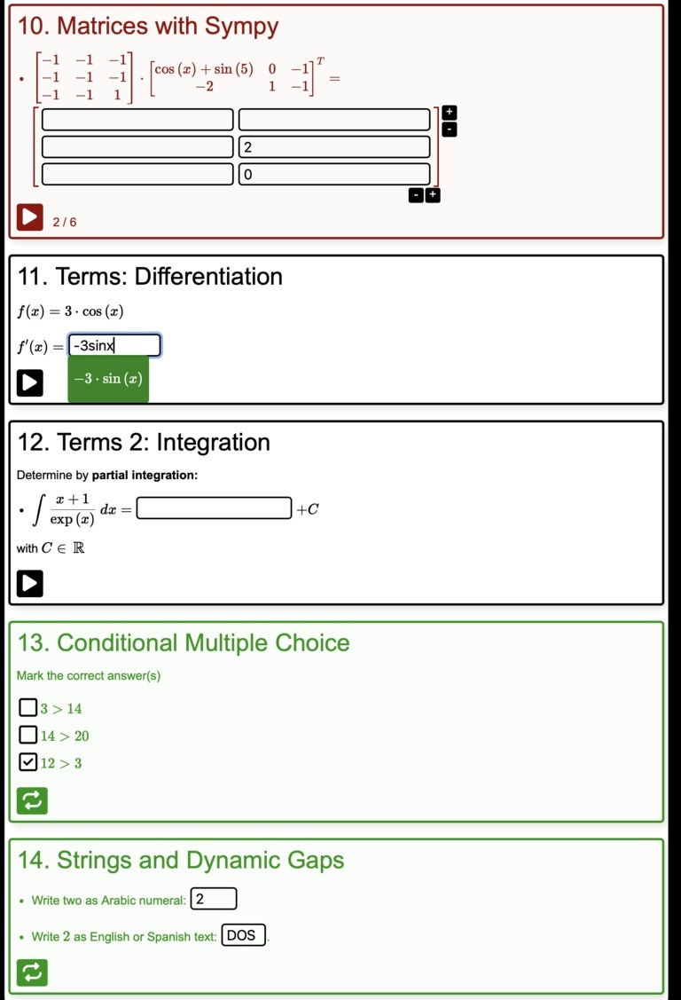

# pySELL

`pySELL` is a Python-based Simple E-Learning Language for the rapid creation of interactive STEM quizzes, with a focus on randomized math questions.

Compared to other solutions (e.g. `STACK` questions), `pySELL` has NO technological dependencies. Generated quizzes consist of one self-contained HTML file. Theses files can be hosted on a web-server or imported to existing _Moodle_ (as file upload) or _Ilias_ (as HTML course) courses.

Student answers are not stored on servers, so `pySELL` quizzes provide an 100 % anonymous training. This is very well received by students on their first contact with new topics.

Teachers benefit from a simple to learn syntax. After some practice, even sophisticated questions can be generated with very little time investment.

If you are using `pySELL` in one of your (university) classes, I would love to hear about that! Write a mail with feedback / bug reports / feature requests to `contact@compiler-construction.com`

As a member of the Free Software Foundation (FSF), I decided to publish `pySELL` as free and open-source software under the license of `GPLv3`.



## User Guide

Download file [`sell.py`](https://raw.githubusercontent.com/andreas-schwenk/pysell/main/sell.py) from this repository. Only this file is required. All other files are used for the development of `pySELL`.

Run `python3 sell.py FILENAME.txt` to generate a self-contained quiz-website `FILENAME.html` from sources in `FILENAME.txt`. You will find an example below, and more examples in directory `examples/`.

Also a file `FILENAME_debug.html` is created, which can be used for debugging purposes. The debug output differs to the release files in the following aspects:

- The sample solution is rendered in the input files
- All questions are evaluated directly, for testing the evaluation
- Single and multiple choice answers are displayed in static order
- Python and text sources are displayed with syntax highlighting
- The line numbers of the source file are shown for each exercise

If you like to use `SageMath` in your code, then run `sage -python sell.py FILENAME.txt`.

_A short developer guide can be found at the end of this document._

## Dependencies

**Users:** Only vanilla Python 3 is required to create basic questions. If you like to use symbolic calculations in your questions, then also `sympy` should be installed (`pip install sympy`). If you require linear algebra, for example `numpy` can be used (`pip install numpy`). For enabling plots, `matplotlib` is supported (`pip install matplotlib`). Also `SageMath` can be used.

**Developers:** Node.js + a local web server for debugging the web code (or alternatively install the recommended VS-code extension in this repository).

## Example

The following example code generates some questions, as can be seen in the figure. You may run the examples [here](https://andreas-schwenk.github.io/pysell/ex1.html).

**Command:**

```bash
python3 sell.py examples/ex1.txt
```

Files `ex1.html` and `ex1_DEBUG.html` will be generated. The latter file shows the sample solution.

Some contents of the example file `examples/ex1.txt` are shown below. Get the complete example file [here](https://github.com/andreas-schwenk/pysell/blob/main/examples/ex1.txt):

```
LANG    en
TITLE   pySELL Demo
AUTHOR  Andreas Schwenk


QUESTION Multiple-Choice
Mark the correct answer(s)
[x] This answer is correct
[x] This answer is correct
[ ] This answer is incorrect


QUESTION Addition
"""
import random
x = random.randint(10, 20)
y = random.randint(10, 20)
z = x + y
"""
Calculate $x + y =$ %z


QUESTION Fibonacci
"""
fib = [1] * 7
for i in range(2,len(fib)):
    fib[i] = fib[i-2] + fib[i-1]
fib3 = fib[3:]
"""
Complete the Fibonacci sequence
- $ 1, 1, 2, $ %fib3, ...


QUESTION Matrices with Sympy
"""
from sympy import *
A = randMatrix(3,3, min=-1, max=1, symmetric=True)
B = randMatrix(2,3, min=-2, max=2, symmetric=False)
x = symbols('x')
B[0,0] = cos(x) + sin(5)
C = A * B.transpose()
"""
- $A \cdot B^T=$ %C
```

## Syntax

This section describes the syntax of `pySELL`. Many aspects are self-explanatory and can be derived from the [example file](https://github.com/andreas-schwenk/pysell/blob/main/examples/ex1.txt).

### Global

- `LANG` defines the natural language, used in the few built-in output strings. Currently, `en`, `de`, `es`, `it`, `fr` are supported.

- `TITLE` defines the title of the page. You may include HTML-code, but everything must be written in the same line, where the title-keyword starts.

- `AUTHOR` defines the author/institution of the quizzes. You may include HTML-code, but everything must be written in the same line, where the author-keyword starts.

- `QUESTION` marks the beginning of a new question. The title of the question is written into the same line.

- `#` introduces a comment, i.e. text that is not considered by the compiler.

### Questions

A question consists of a textual part, and optionally of Python code that generates random variables and calculates the sample solution.

**Question text**

All text shown to the student is written as plain text. Formatting options are as follows:

- Italic text is embedded into a pair of single asterisks `*` (e.g. `math is *cool*`).

- Bold text is embedded into a pair of double asterisks `**` (e.g. `math can be **challenging**`).

- Embedded code is written into a pair of accent graves `\``.

- Itemizations are preceded by `-`.

- TeX-based inline math is embedded into a pair of `$` (e.g. `$\sqrt{x^2+y^2}$` for $\sqrt{x^2+y^2}$).

- TeX-based display style math is embedded into a pair of `$$` (display mode in inline math can also be activated in inline math mode by writing e.g. `$\displaystyle \sum_{i=1}^n i^2$`).

- Multiple-Choice questions are preceded by `[x]` for correct answers, or `[ ]` for incorrect answers, respectively. The text is separated by a space (e.g. `[x] This answer is correct`).

- Single-Choice questions are preceded by `(x)` for the correct answer, and `( )` for incorrect answers, respectively. Only one answer can be true. (e.g. `( ) This answer is incorrect`).

- A line break can be forced by `\\` at the end of a line (e.g. `A new paragraph will start after this line. \\`).

- Static images can be included with `!`, following the path and optionally following the width in percentage (path and width are separated by `:`). For example, `!myImage.svg:25` shows the image in path `myImage.svg` with a width of `25%` (related to the question box). File paths are relative to the currently translated `pySELL` input file. If the width is omitted, `100%` is assumed. Supported image formats are `svg`, `png`, and `jpg`. Note that image data is directly embedded into the output files, so you do not need to publish them separately. You should care about the file size of images! Usually, `svg` files are very small for vector graphics (hint: use the tool `pdf2svg` to generate SVG-files from PDF-files. The latter can e.g. be generated by `tikZ`). For dynamic plots via `matplotlib`, read the next section.

**Question code**

To generate randomized variables, arbitrary Python-Code can be evaluated (this is secure, since the code is executed only locally on the teachers computer).

For each question that includes randomization (the compiler checks, if your Python code contains the string `rand`), 5 distinct instances are drawn. If you use a bad randomization, some instances may be equal. In case that you won't use random numbers, there will be only one instance.

- Python code is embedded into a pair of `"""`. The triple-quotations must be written in distinct lines, without any other characters in these lines. Python code must be provided **before** its variables are accessed in the textual part.

- Variables denoted in math mode are replaced by its actual values (the execution environment randomly chooses one of the 5 instances). This behavior can be suppressed by embedding the variable name into double quotes (e.g. write `"x"` instead of just `x`).

  **Warning: Variable names with underscore (e.g. `x_1`) are not allowed, since the underscore would be ambiguous in TeX.**

- Input fields are generated by `%`, followed by the referred variable name. The structure of the input field depends on the variable type of the variable (`int`, `set`, `numpy.array`, ...). If the variable is non-scalar, parentheses (or brackets, or braces) will be rendered around vectors/sets/... To suppress theses parentheses, write `%!`, followed by the variable name. This is e.g. used in the _Fibonacci_ example in the example file. Example: `The answer is %answer`.

- In general, variables can only be accessed within math mode (i.e. in `$...$`). If you like to use Python-generated variables of type `str` (strings) seamlessly in the question text, use the ampersand operator `&`, followed by the variable name in text mode. Example: `Today I feel &mood`.

- For asking gap questions, use `%`, followed the expected word(s), embedded into double quotes (e.g. `%"three"`). If you like to accept more than one answer, separate the words by the pipe operator `|`. Example: `%"three|tres|trois|tre"`.

- Dynamic gaps can be created with Python code. Just generate a string variable (e.g. `answer = "three|tres"`) and ask it exactly as for number inputs (e.g. `%answer`)

- For static or dynamic plots, refer to the `Plot` example in the examples. `pySELL` supports using `matplotlib`.

_Hint: if a question as no input fields, the evaluation button is not shown._

**Important notes**

- Consider to exclude Python variables from the output. For example, `matplotlib` requires to define axes. The $x$-vector `x = np.linspace(-10,10,1000)` has length 1000. `pySELL` will write that to the question database by default, so you should write `del x` at the end of your Python code, to exclude `x`.

- In general, you may import arbitrary Python libraries. `pySELL` will do its best to map data types to internal data types (e.g. some commonly used `sage` data types are mapped). For all unimplemented types, the variable is considered to be a _term_ and the value is exported by `str(my_var)`. This may work, or may not. Feel free to ask the author of `pySELL` to extend support of missing/exotic data types.

<!-- TODO: write about types (impl is WIP):
int, float, set, matrix
-->

### Hints on generating random variables

_Note: also read about the custom function `rangeZ`, to exclude the zero from a range, below._

Read the docs:

- [https://docs.python.org/3/library/random.html](https://docs.python.org/3/library/random.html)

Examples:

#### Draw a random integer `a` from `{-2,-1,...,5}`:

```python
import random
a = random.randint(-2,5)
# equivalent:
a = random.choice(range(-2,5+1))
```

_The examples explicitly write `+1` to clarify that the upper bound is not included._

#### Choose a random number `a` from set `{2,3,5,7}`:

```python
import random
a = random.choice([2,3,5,7])
```

_Note that the parameter is actually a list._

#### Draw 3 random integers `a`, `b`, `c` from `{-2,-1,...,5}` with replacement:

```python
import random
# store in a, b, c
[a,b,c] = random.choices(range(-2,5+1),k=3)
# store as array x
x = random.choices(range(-2,5+1),k=3)
```

_Note that the upper bound of `range` is **excluded**._

#### Draw 3 **unique** (i.e. without replacement) random integers `a`, `b`, `c` from `{-2,-1,...,5}`:

```python
import random
# store in scalar variables a, b, c
[a,b,c] = random.sample(range(-2,5+1),k=3)
# store as an array/list x
x = random.sample(range(-2,5+1),k=3)
# store as a set y
y = set(random.sample(range(-2,5+1),k=3))
```

_Note that the upper bound of `range` is **excluded**._

#### Shuffle a list `[2,4,6,8]` (e.g. to get `[6,8,4,2]`):

```python
import random
# in place shuffling
x = [2,4,6,8]
random.shuffle(x)
# one liner with immutable input
x = random.sample([2,4,6,8],k=4)
```

#### Generate a 2 x 3 matrix `A` with random integer elements from `{-2,-1,...,5}` using `numpy`:

```python
import numpy
A = numpy.random.randint(-2, 5, size=(2,3))
# overwrite element A_{0,0}
A[0,0] = 1337
```

Elements are limited to numbers.

#### Generate a 2 x 3 matrix `A` with random integer elements from `{-2,-1,...,5}` using `sympy`:

```python
from sympy import *
A = randMatrix(2,3, min=-2, max=5, symmetric=False)
# overwrite element A_{0,0}
x, y = symbols('x,y')
A[0,0] = sin(x) * cos(y)
```

Elements can also be terms.

#### Excluding the zero

In some cases, it may be beneficial to exclude the zero from random number generation. For example, a numerical question would be too easy to solve, if zero is drawn for a variable.

`pySELL` provides a function `rangeZ` that behaves syntactically similar to `range`, but excludes the zero.

Example to draw 3 random numbers `a`, `b`, `c` from `{-2,-1,1,2,3}` with replacement:

```python
import random
# get a single random number
a = random.choice(rangeZ(-2,3+1))
# get 3 numbers with replacement (some of a,b,c may be equal)
[a,b,c] = random.choices(rangeZ(-2,3+1),k=3)
# get 3 numbers without replacement (a,b,c are distinct)
[a,b,c] = random.sample(rangeZ(-2,3+1),k=3)
```

_Note that the result of `rangeZ` is of type `list`, while the built-in function `range` returns type `range`. This may be destructive in some cases!_

## Developer Guide

To debug (or extend) the web code, first convert an input file into a json file with the `-J` option enabled, e.g. `python3 sell.py -J src/ex1.txt`. Then `src/ex1.json` is generated.

Then start a local web server (e.g. using `python3 -m http.server 8000`) and open `web/index.html` (e.g. `localhost:8000/web/`, if your port number is 8000). The uncompressed JavaScript code in directory `web/src/` is interpreted as module.

To update `sell.py` after any change in the JavaScript code, and run `python3 build.py` in order to update variable `html` in file `sell.py`.
